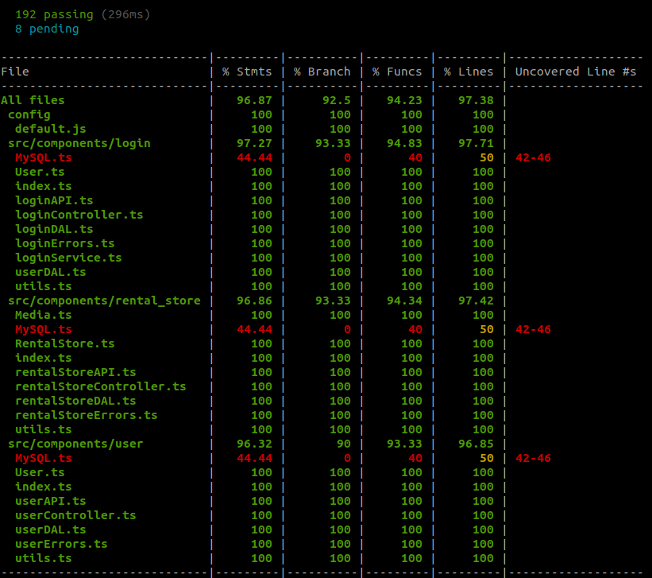

#  4all - Locadora de vídeo
Há duas formas de testar a ferramenta, utilizando os serviços da própria máquina ou utilizando containers via Docker.

## Host
Os serviços necessários são nodejs 14+ e do MySQL 8

### Build
Para efetuar o processo de build, seguir os passos abaixo:

#### Backend
```javascript
git clone https://github.com/JoseLeandroSantosJustin/4all.git
cd 4all/backend/
mkdir logs
npm install
npm run build
```
#### Database
```bash
sudo mysql -u root -p
Informar a senha
```
Após estar conectado ao banco de dados é necessário executar os comandos deste [script](./database/script/schema.sql) inclusive os comandos comentados nas 5 linhas iniciais

#### Deploy
Estando com os serviços configurados basta acessar a pasta */4all/backend* e executar o comando **npm run start**

## Docker
### Arquitetura
Com o intuito de facilitar os processos de build e deploy o sistema foi dividido em 2 docker containers: 4alldatabasecontainer e 4allbackendcontainer

#### Deploy
Para os processos de build e deploy com o Docker é necessário criar o diretorio de log em */4all/backend* e então executar o comando **docker-compose up** da raiz da pasta clonada */4all*, por exemplo:
```bash
git clone https://github.com/JoseLeandroSantosJustin/4all.git
cd 4all/
mkdir backend/logs
docker-compose up
```

> CUIDADO: É necessário esperar a mensagem **4alldatabasecontainer | ... [System] [MY-010931] [Server] /usr/sbin/mysqld: ready for connections. Version: '8.0.22'  socket: '/var/run/mysqld/mysqld.sock'  port: 3306  MySQL Community Server - GPL.** ser exibida no terminal, caso alguma requisição seja executada antes o resultado será *{ "error": "Unknown system error" }*

# Documentação da API
A documentação da API se encontra [aqui](./documentation/documentation.md)

# Testes
Foram criados 192 testes unitários do quais contemplam 96% da aplicação segundo o modulo NYC. Para a execução dos testes é necessário seguir os passo sendo utilizando os serviços na pópria maquina e então executar o comando **npm run coverage** do diretório */4all/backend*


